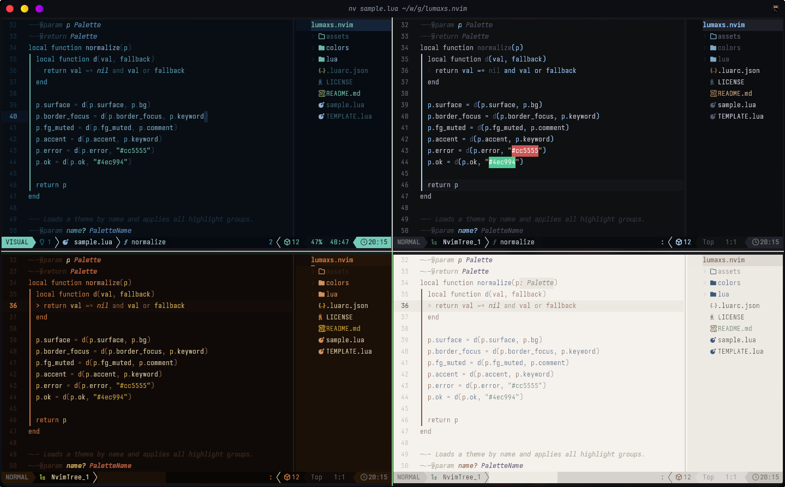
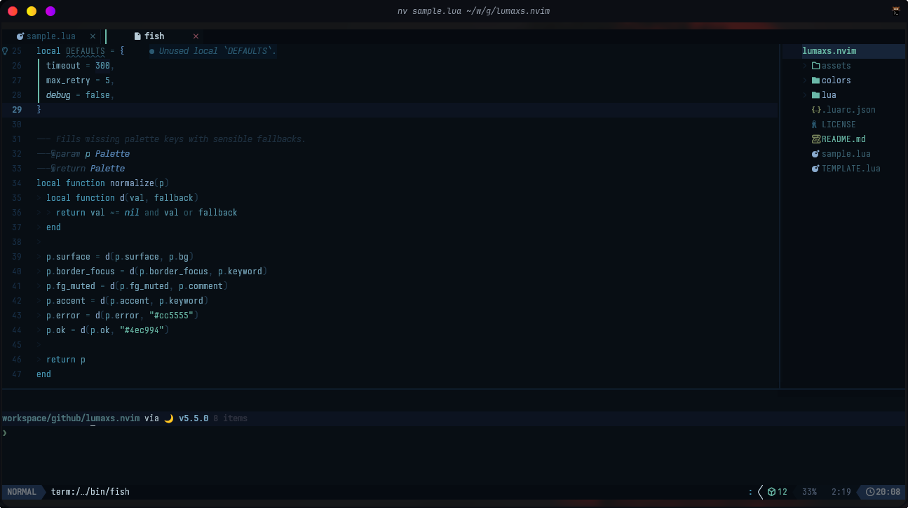
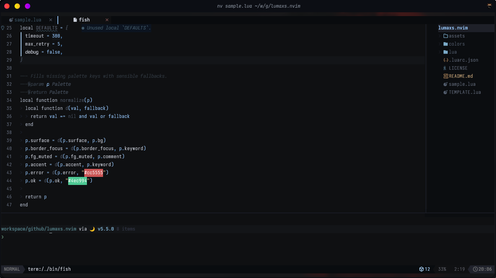
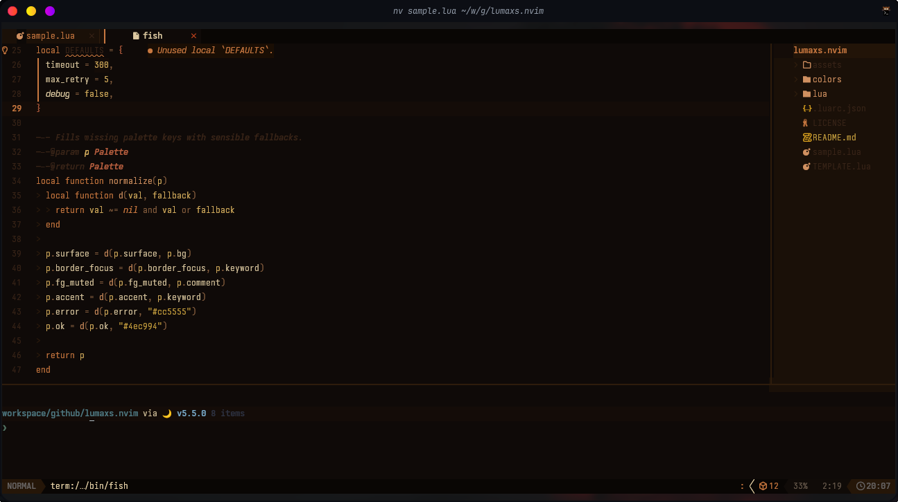
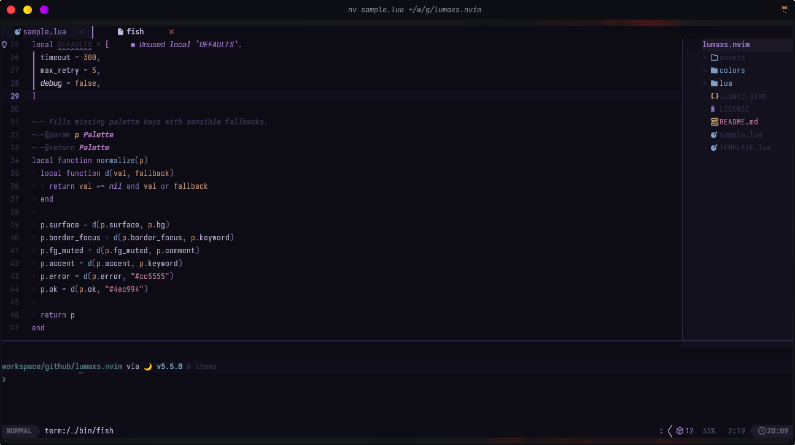
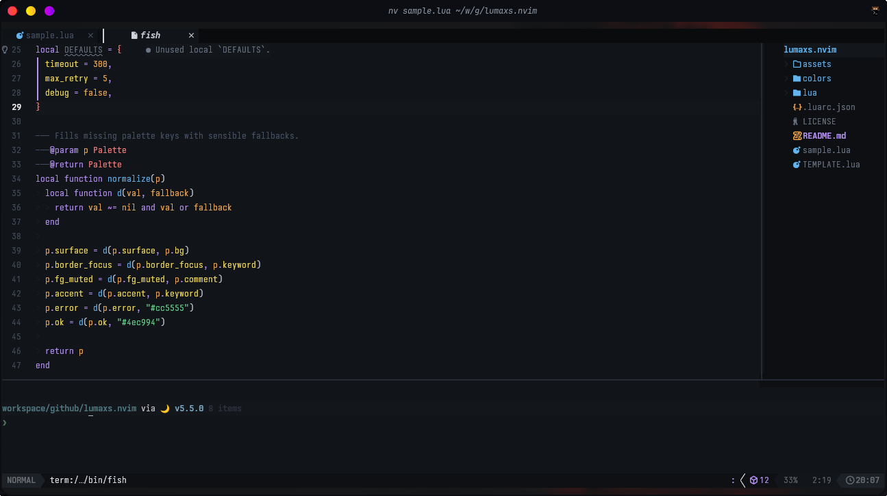
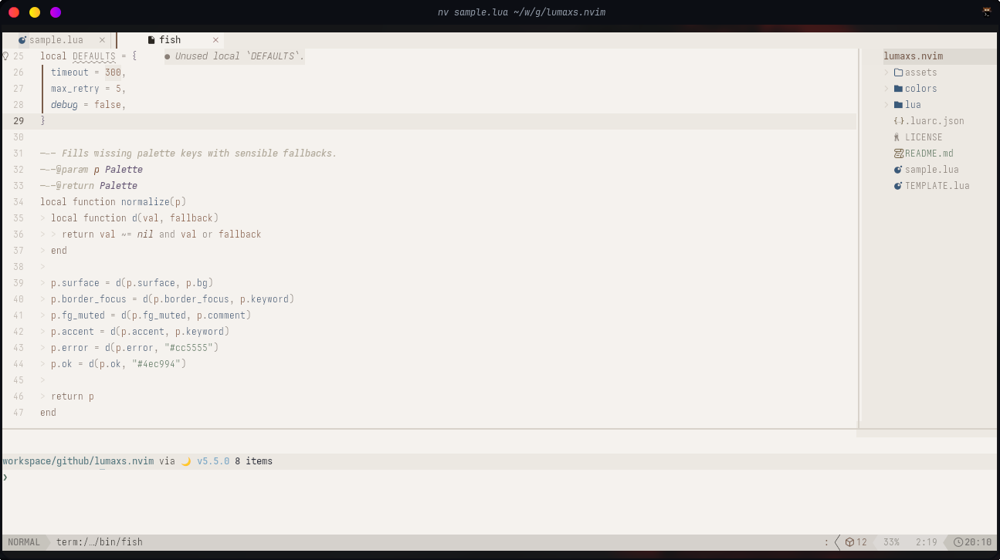
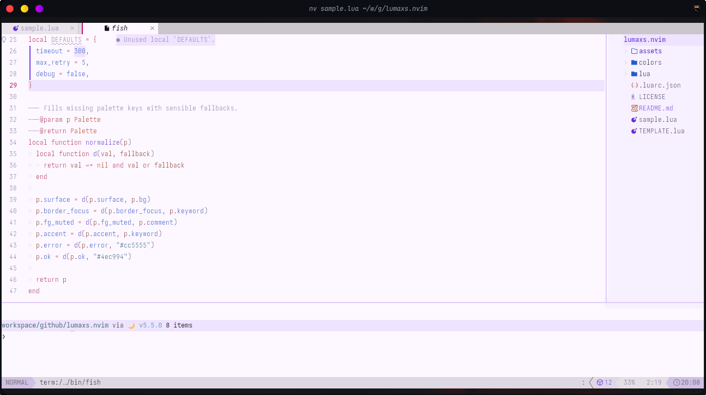
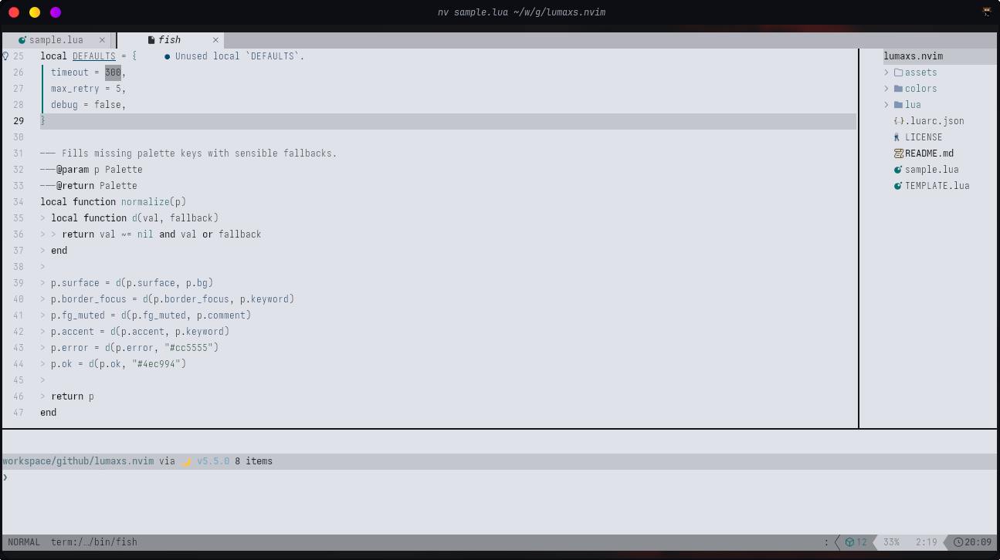

<div align="center">


# lumaxs.nvim

**A Neovim colorscheme collection** — dark, light and monochrome themes with full
[Treesitter](https://github.com/nvim-treesitter/nvim-treesitter),
[LSP semantic tokens](https://neovim.io/doc/user/lsp.html) and popular plugin support.

[](LICENSE)
[](https://neovim.io)
[](https://lua.org)

</div>

---

## Available themes

| Name       | Vibe                                                       | Type  |
| ---------- | ---------------------------------------------------------- | ----- |
| `glacier`  | Cold, bluish — each token at its own temperature           | Dark  |
| `cinder`   | Almost colorless — graphite background, single blue accent | Dark  |
| `ember`    | Fireplace in the dark — warm and saturated                 | Dark  |
| `noturne`  | 2am bedroom — indigo-purple, pale lavender                 | Dark  |
| `dark`     | Colorful dark — green, blue, purple, orange                | Dark  |
| `salt`     | Printed ink — light cream, terracotta, sage                | Light |
| `light`    | Soft lavender — Zed light theme                            | Light |
| `light-v2` | Lavender v2 — refined mirror of light                      | Light |

---

## Previews

### showcase



### glacier



### cinder



### ember



### noturne



### dark



### salt



### light



### light-v2



---

## Requirements

- Neovim **≥ 0.9**
- `termguicolors` enabled (the plugin sets this automatically)

---

## Installation

### lazy.nvim

```lua
{
  "emersonbernardini/lumaxs.nvim",
  lazy = false,
  priority = 1000,
  config = function()
    vim.cmd.colorscheme("lumaxs-glacier")
  end,
}
```

### Packer

```lua
use {
  "emersonbernardini/lumaxs.nvim",
  config = function()
    vim.cmd.colorscheme("lumaxs-glacier")
  end,
}
```

### Manual (vim-plug / git)

```vim
" vim-plug
Plug 'emersonbernardini/lumaxs.nvim'
```

```sh
# git (manual)
git clone https://github.com/emersonbernardini/lumaxs.nvim \
  ~/.local/share/nvim/site/pack/themes/start/lumaxs.nvim
```

---

## Configuration

### Theme selection via `colorscheme`

```vim
" Load glacier (default / alias "lumaxs")
colorscheme lumaxs

" Or pick directly by name:
colorscheme lumaxs-glacier
colorscheme lumaxs-cinder
colorscheme lumaxs-ember
colorscheme lumaxs-noturne
colorscheme lumaxs-dark
colorscheme lumaxs-salt
colorscheme lumaxs-light
colorscheme lumaxs-light-v2
```

### Via Lua

```lua
-- Simple
require("lumaxs").load("cinder")

-- Inside init.lua / lazy config
vim.cmd.colorscheme("lumaxs-noturne")
```

---

## Overrides

Each palette can define an `overrides` function that is applied after the default
highlight groups. This lets you customize specific groups without touching the rest
of the theme.

To override groups in a theme that doesn't define them, do it after loading:

```lua
-- After loading the theme:
vim.api.nvim_set_hl(0, "Normal",  { fg = "#c8cdd8", bg = "#0f1012" })
vim.api.nvim_set_hl(0, "Comment", { fg = "#505a6a", italic = true })
```

To build a custom palette with overrides, see [Creating new themes](#creating-new-themes) below.

---

## Supported plugins

lumaxs.nvim ships highlight groups for the following plugins, ready to use with
no extra configuration:

| Category           | Plugins                                                                                           |
| ------------------ | ------------------------------------------------------------------------------------------------- |
| **Editor**         | Treesitter, LSP Semantic Tokens                                                                   |
| **Completion**     | nvim-cmp, blink-cmp                                                                               |
| **Fuzzy finder**   | Telescope, fzf-lua                                                                                |
| **File tree**      | nvim-tree, neo-tree                                                                               |
| **Git**            | gitsigns                                                                                          |
| **Indentation**    | indent-blankline (v2 and v3)                                                                      |
| **UI / Floats**    | noice, nvim-notify, which-key                                                                     |
| **Navigation**     | flash.nvim                                                                                        |
| **Plugin manager** | lazy.nvim, mason.nvim                                                                             |
| **Statusline**     | lualine, mini.statusline                                                                          |
| **Tabline**        | bufferline.nvim, mini.tabline                                                                     |
| **Diagnostics**    | trouble.nvim                                                                                      |
| **Outline**        | aerial.nvim                                                                                       |
| **Dashboard**      | alpha-nvim, dashboard-nvim, snacks.nvim                                                           |
| **Mini.nvim**      | mini.pick, mini.files, mini.notify, mini.diff, mini.map, mini.starter, mini.hipatterns, mini.clue |
| **Markdown**       | render-markdown.nvim                                                                              |

---

## Project structure

```
lumaxs.nvim/
├── colors/
│   ├── lumaxs.lua              ← :colorscheme lumaxs  (glacier default)
│   ├── lumaxs-glacier.lua
│   ├── lumaxs-cinder.lua
│   ├── lumaxs-ember.lua
│   ├── lumaxs-noturne.lua
│   ├── lumaxs-dark.lua
│   ├── lumaxs-salt.lua
│   ├── lumaxs-light.lua
│   └── lumaxs-light-v2.lua
├── lua/
│   └── lumaxs/
│       ├── init.lua            ← main loader
│       ├── highlights.lua      ← all highlight groups
│       └── palettes/
│           ├── glacier.lua
│           ├── cinder.lua
│           ├── ember.lua
│           ├── noturne.lua
│           ├── dark.lua
│           ├── salt.lua
│           ├── light.lua
│           └── light-v2.lua
├── TEMPLATE.lua                ← guide for new themes
├── LICENSE
└── README.md
```

---

## Creating new themes

1. Copy `TEMPLATE.lua` to `lua/lumaxs/palettes/mytheme.lua`
2. Define the required fields (`bg`, `fg`, `keyword`, `func`, `type_`,
   `string`, `number`, `comment`, `operator`)
3. Optionally define extra fields or an `overrides` function:

```lua
-- lua/lumaxs/palettes/mytheme.lua
return {
  bg      = "#1a1b26",
  fg      = "#c0caf5",
  keyword = "#bb9af7",
  func    = "#7aa2f7",
  type_   = "#f7768e",
  string  = "#9ece6a",
  number  = "#ff9e64",
  comment = "#565f89",
  operator = "#89ddff",

  -- overrides: groups that differ from the default behavior
  overrides = function(c)
    return {
      ["@comment.documentation"] = { fg = "#4d5280", italic = true },
      ["FloatBorder"]             = { fg = c.border_focus },
    }
  end,
}
```

4. Create the entry file at `colors/lumaxs-mytheme.lua`:

```lua
require("lumaxs").load("mytheme")
```

5. Apply with `:colorscheme lumaxs-mytheme`

---

## Contributing

1. Fork the repository
2. Create a branch: `git checkout -b feat/my-theme`
3. Follow the existing structure (`TEMPLATE.lua`)
4. Do not modify colors of existing themes in PRs for other themes
5. Open a Pull Request with a clear description of the theme's vibe

---

## License

MIT © [Emerson Bernardini](https://github.com/emersonbernardini) — see [LICENSE](LICENSE)

---

## Credits

- Structure inspired by [folke/tokyonight.nvim](https://github.com/folke/tokyonight.nvim)
  and [rebelot/kanagawa.nvim](https://github.com/rebelot/kanagawa.nvim)
- Palettes hand-crafted by Emerson Bernardini
